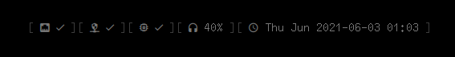

# dwmBar

dwmBar is a status bar for [dwm](https://dwm.suckless.org)
similar to [dwmblocks](https://github.com/torrinfail/dwmblocks).

This is my fork of tonymugen's dwmBar: [tonymugen/dwmBar](https://github.com/tonymugen/dwmBar).
Head over there for more details.

It's multi-threaded, fast and lightweight, and easy to configure.



## Changes compared to the [original](https://github.com/tonymugen/dwmBar)

- Load colors from Xresources
- Completely removed the internal modules feature
(you'll only use your own modules anyway)
- Replace newline characters in modules' output with a space, so
that spaces between elements can come naturally
- You can add separate delimiters for before, in between and after modules
- Cleaned up the code visually

## Modules

[Here are my scripts.](https://github.com/soystemd/dotfiles/tree/master/scripts/.local/bin/dwmbar)

## Configure

dwmBar is configured by editing the `config.hpp` file.

## Install

```sh
git clone https://github.com/soystemd/dotfiles
cd dwmBar
make
sudo make install
```

This will put the `dwmbar` binary in `/usr/local/bin/` and assumes
gcc is the compiler on the system.

If you have llvm instead, use `make CXX=c++`.

## Dependencies

The project depends on a C++ compiler that understands C++11. It also requires
`libX11` for printing to the root window.
